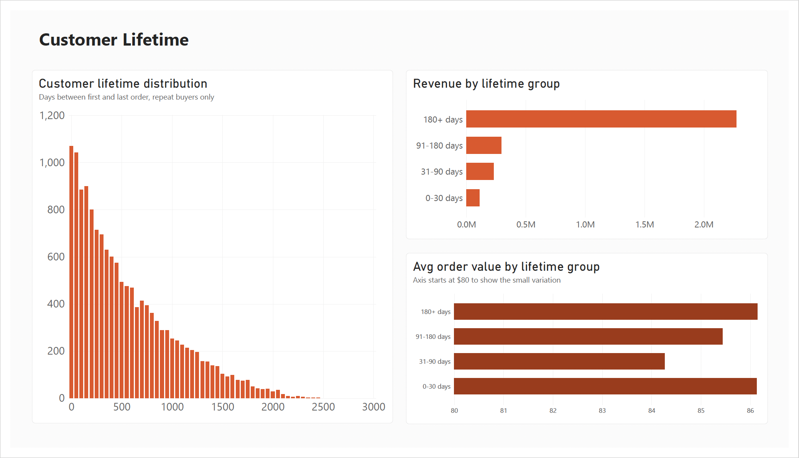

# TheLook E-commerce — Customer Behaviour Dashboard

A Power BI dashboard analyzing customer purchasing behavior using TheLook, a synthetic e-commerce dataset from kaggle.

## Project overview

This project answers three core business questions about customer behavior using order and customer data from TheLook E-commerce dataset. The goal was to generate actionable insights that could support business decisions around customer engagement, segmentation, and retention. To achieve this, I focused on three core business questions and built a three-page Power BI dashboard to explore: **who buys, how they differ, and how long they stay.**

## Business questions

1. Who are the most frequent buyers, and what is their average order value?
2. Can customers be segmented based on purchasing behavior or demographics?
3. What is the distribution of customer lifetimes, and how does it impact sales?

## Data source

- **Dataset:** [Looker E-commerce BigQuery Dataset](https://www.kaggle.com/datasets/mustafakeser4/looker-ecommerce-bigquery-dataset) (Kaggle, originally sourced from Google's `thelook_ecommerce` public BigQuery dataset)
- **Note:** This is a **synthetic dataset**. Customer names, emails, and addresses are fabricated and were excluded from the model entirely. Patterns (e.g. purchase frequency capping at 4 orders per customer) reflect the data generation process rather than real-world behavior.
- **Analysis window:** 2019-01-01 to 2025-12-31 (2026 excluded as a partial year)
- **Tables used:** `users`, `orders`, `order_items`

## Dashboard

### 1. Overview

High-level KPIs (Revenue, Total Orders, Average Order Value, Buyers) and the overall growth trend, broken out by order status.

### 2. Customer Segmentation

Segments customers by purchase frequency (one-time / repeat / frequent) and compares behavior across age, gender, and country. Interactive slicers let you filter by year, gender, age group, and country.

### 3. Customer Lifetime

Distribution of customer lifetime (days between a customer's first and last order) and how revenue and average order value vary across lifetime groups.

## Key insights

- **Revenue increased substantially from 2019 to 2025, while average order value remained relatively stable at around $86. This suggests that growth was primarily driven by an increase in order volume rather than higher spending per order.
- **A small group of frequent buyers drives a disproportionate share of revenue.** Customers with 3+ orders make up only ~7% of buyers but generate ~18% of revenue — driven by purchase frequency, not higher spend per order (AOV is nearly identical across frequency groups, ~$85–87).
- **Demographics don't meaningfully predict purchase behavior.** Repeat purchase rate is consistent (~27–29%) across age groups, gender, and countries with a meaningful sample size (1,000+ buyers). Countries with very few buyers showed extreme repeat rates that turned out to be statistical noise from small sample sizes, not real behavioral differences — a reminder to always check sample size before trusting a rate.
- **Customer lifetime length doesn't predict spending per order.** Customers active over a longer window (180+ days between first and last order) generate more total revenue simply because they have more opportunities to purchase — but their average order value is no higher than a customer who made all their purchases in a short window.
- **Takeaway:** Purchase frequency appears to be the most useful segmentation variable in this dataset. Unlike demographic and lifetime-based segments, frequency groups show a clear relationship with revenue contribution, suggesting that increasing repeat purchases may be a more relevant business focus than targeting customers based solely on demographic characteristics.

## Tools

- **Power BI Desktop** — data modeling, DAX measures, report design
- **DAX** — custom measures (Revenue, Avg Order Value, Repeat Rate, Customer Lifetime, etc.)
- **Power Query** — data cleaning, type conversion, column pruning
- **Google BigQuery** — data source

## How this was built

1. Explored the dataset and confirmed table relationships (`users` → `orders` → `order_items`, one-to-many)
2. Checked data quality (row counts, key uniqueness, nulls, outliers) and decided on a cleaning approach (Cancelled orders excluded from revenue metrics; Returned orders kept)
3. Ran exploratory analysis to answer each business question in turn, checking sample sizes before trusting any rate-based comparison
4. Designed and built the three-page report shown above